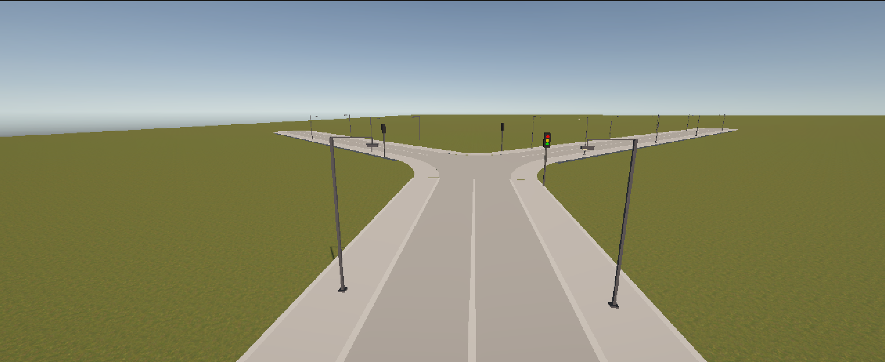

# Road Pro — Runtime Road Placement Tool for Unity


> **First public release — actively under development.**  
> Road Pro is a runtime road placement system for Unity. Place, connect, and manage roads at runtime with automatic intersections, traffic lights, and street lights.



---

## Features

- **Runtime Road Placement** — Draw roads in Play Mode with mouse input
- **Automatic Intersections** — Roads that cross or meet form junctions automatically
- **Intersection Meshes** — Smooth mesh generation at junctions
- **Terrain Following** — Roads conform to terrain height
- **Lane System** — Configurable lane patterns (driving, walking)
- **Traffic Light Spawner** — Automatic traffic lights at 3+ way intersections
- **Street Light Spawner** — Automatic street lights along roads with configurable spacing
- **URP / Built-in Support** — Shaders for both pipelines
- **Modular Codebase** — Clean separation of generation, math, geometry, and Unity layers

---

## Installation

### Option 1: Unity Package Manager (UPM) via Git URL

1. Open `Window > Package Manager`
2. Click `+` → `Add package from git URL`
3. Paste:

```
https://github.com/Atum-Borg-Interactive/Road-SDK.git?path=Assets/RoadPro
```

Updates are handled through the Package Manager.

### Option 2: Manual Install

1. Download or clone this repository
2. Copy the `Assets/RoadPro` folder into your project's `Assets/` directory
3. The tool is ready to use

### Option 3: UnityPackage Export

*(Coming soon)*

---

## Quick Start

1. Open the project or import Road Pro into your project
2. Open a scene
3. Select `GameObject > Create Empty` and name it `RoadManager`
4. Add the `RoadProSetup` component (located in `Assets/RoadPro/Demo/`)
5. Enter Play Mode
6. Press **R** to enter road placement mode
7. **Left-click** on the ground to set the first road endpoint
8. **Left-click** again to set the second endpoint — a road is created
9. Continue clicking to add more connected roads
10. Press **Esc** or **Right-click** to cancel placement
11. Roads automatically form intersections where they cross or meet

> **Note:** The demo script `RoadProSetup` is provided as a starting point. For full control, use the `RoadBuilder`, `TrafficLightSpawner`, and `StreetlightSpawner` components directly.

---

## Controls

| Key / Input | Action |
|---|---|
| **R** | Enter road placement mode |
| **Left-click** | Place road start / end point |
| **Right-click drag** | Orbit camera |
| **Scroll wheel** | Zoom in / out |
| **WASD** | Move camera |
| **X** | Enter bulldoze mode (remove roads) |
| **Esc** | Cancel current placement |

### Workflow

1. Press **R** — a preview line follows your mouse
2. **Left-click** on the ground — anchor the first point
3. Move the mouse — the preview shows the road path
4. **Left-click** again — places the road between the two points
5. The road snaps to terrain height automatically
6. If the road crosses an existing road, an intersection is created
7. At 3+ way intersections, traffic lights appear on the right sidewalk
8. Street lights are placed along both sides of every road

---

## Project Structure

```
Assets/RoadPro/
├── Demo/
│   └── RoadProSetup.cs          — Demo setup script
├── Scripts/
│   ├── Generation/
│   │   ├── Heightfinder.cs      — Terrain height sampling
│   │   ├── Intersection.cs      — Intersection data & logic
│   │   ├── IntersectionData.cs  — Intersection state container
│   │   ├── IntersectionManager.cs — Manages all intersections
│   │   ├── IntersectionMeshBuilder.cs — Builds intersection meshes
│   │   ├── PathFinder.cs        — Road pathfinding
│   │   ├── RoadGenerator.cs     — Road data container
│   │   ├── RoadMeshBuilder.cs   — Builds road meshes
│   │   └── RoadRegistry.cs      — Central road registry
│   ├── Geometry/
│   │   ├── CrossingDetect.cs    — Detects road crossings
│   │   └── Intersect.cs         — Geometry intersection math
│   ├── Math/
│   │   ├── PolyLine3.cs         — 3D polyline utilities
│   │   └── Tessellator.cs       — Mesh tessellation
│   └── Unity/
│       ├── RoadBuilder.cs       — Core placement logic (MonoBehaviour)
│       ├── RoadRenderer.cs      — Road mesh rendering
│       ├── ShaderCache.cs       — Material caching
│       ├── StreetlightSpawner.cs — Automatic street lights
│       └── TrafficLightSpawner.cs — Automatic traffic lights
├── Shaders/
│   ├── RoadLit.shader           — Lit road shader (built-in)
│   ├── RoadPreview.shader       — Preview/ghost road shader
│   └── URPLambert.shader        — URP-compatible shader
└── package.json                 — UPM package manifest
```

---

## Components Overview

### RoadBuilder
The core placement component. Handles mouse input, road creation, crossing detection, and mesh rebuilding.

### TrafficLightSpawner
Attach to the same GameObject as `RoadBuilder`. Automatically spawns traffic lights at intersections with 3 or more connected roads. Lights are placed on the right sidewalk (driver's right) of each approaching road.

**Configuration fields:**
- `offsetBackFromStop` — Distance from the stop line
- Pole/signal housing dimensions and materials

### StreetlightSpawner
Attach to the same GameObject as `RoadBuilder`. Automatically spawns street lights along both sides of every road with consistent spacing.

**Configuration fields:**
- `spacing` — Distance between lights (default: 35m)
- `offsetFromEdge` — Offset from road edge
- Pole/lamp materials

---

## Planned Upgrades

Road Pro is in active development. Planned improvements include:

- [ ] Undo/redo support
- [ ] Road deletion and modification tools
- [ ] Highway-style ramps and interchanges
- [ ] Traffic light timing and state machine
- [ ] Pedestrian crossing marks
- [ ] Roundabout support
- [ ] Save/load road networks
- [ ] Runtime road editing (drag nodes)
- [ ] Multi-lane road support
- [ ] Bridge and tunnel detection
- [ ] UnityPackage export
- [ ] More comprehensive demo scenes
- [ ] Dedicated documentation website

---

## License

This project is licensed under the MIT License — see the [LICENSE](LICENSE) file for details.

---

## Contributing

Contributions are welcome! Since this is an early-stage project, here's how you can help:

1. **Fork** the repository
2. Create a **feature branch** (`git checkout -b feature/your-feature`)
3. **Commit** your changes
4. **Push** to your branch
5. Open a **Pull Request**

For bug reports and feature requests, please [open an issue](https://github.com/Atum-Borg-Interactive/Road-SDK/issues).

---

## Screenshots


*Placing roads in Play Mode*


*Automatic traffic lights at 3+ way intersections*


*Street lights along roads with consistent spacing*


*Multi-road network with intersections*

---

*Built with Unity 6000.0.75f1*
